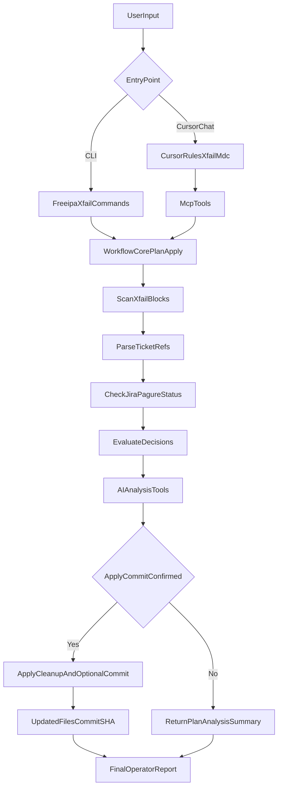

# freeipa-xfail-agent

Agentic workflow to clean up stale `pytest.mark.xfail` markers in FreeIPA tests by checking linked JIRA and Pagure tickets.

## What this project does

- Scans `ipatests/test_integration` and `ipatests/test_xmlrpc` (or custom paths)
- Extracts ticket references from xfail decorators
- Checks ticket status through read-only APIs
- Removes xfails only when linked tickets are closed
- Distinguishes plain vs conditional xfail markers
- Supports interactive terminal selection (arrow keys + checkbox)
- Supports branch-aware workflows and optional commit preparation
- Exposes both a CLI and an MCP server

## Why this exists

In long-lived branches, xfails often remain even after tickets are resolved. This project helps continuously align tests with current tracker state and produce review-ready changes.

## End-to-end workflow



## Quick start (CLI)

1) Install:

```bash
python -m venv .venv
source .venv/bin/activate
pip install -e .
```

2) Set tracker variables (read-only tokens):

```bash
export JIRA_BASE_URL="https://your-jira.example.com"
export JIRA_EMAIL="you@example.com"
export JIRA_API_TOKEN="***"
```

Pagure variables are optional for FreeIPA public issues:

```bash
# Optional only:
# export PAGURE_BASE_URL="https://pagure.io"
# export PAGURE_API_TOKEN="***"
```

3) Basic commands:

```bash
freeipa-xfail branches --repo-path /path/to/freeipa
```

```bash
freeipa-xfail scan \
  --repo-path /path/to/freeipa \
  --branch master \
  --expected-origin your-github-username \
  --path ipatests/test_integration \
  --path ipatests/test_xmlrpc
```

```bash
freeipa-xfail apply \
  --repo-path /path/to/freeipa \
  --branch master \
  --create-branch xfail-cleanup-master \
  --expected-origin your-github-username \
  --commit
```

Interactive selection mode:

```bash
freeipa-xfail apply \
  --repo-path /path/to/freeipa \
  --branch master \
  --interactive \
  --xfail-selection all
```

Interactive preview-only mode (no writes):

```bash
freeipa-xfail apply \
  --repo-path /path/to/freeipa \
  --branch master \
  --interactive \
  --dry-run \
  --xfail-selection all
```

## Cursor MCP setup (org-friendly)

### Step 1 - Install package

Option A:

```bash
uv sync
```

Option B:

```bash
pip install -e .
```

### Step 2 - Install Cursor config

From workspace root:

```bash
bash install.sh
```

Installer behavior:

- installs `.cursor/rules/xfail.mdc`
- installs `.cursor/mcp.json` if missing
- if `.cursor/mcp.json` exists, prints merge snippet for `mcpServers.freeipa-xfail-agent`

Template files:

- `cursor-config/mcp.json`
- `cursor-config/rules/xfail.mdc`

The MCP template uses workspace-local runtime defaults:

- `command: .venv/bin/python`
- `PYTHONPATH=src`

This avoids `ModuleNotFoundError: No module named freeipa_xfail_agent` when Cursor starts MCP with system Python.

### Step 3 - Restart Cursor

Cursor reads `.cursor/mcp.json` on startup.

### Step 4 - Verify

Open Cursor chat and run:

```text
/xfail-plan
```

## MCP server and tools

Run server:

```bash
freeipa-xfail-mcp
```

or:

```bash
python3 -m freeipa_xfail_agent.mcp_server
```

Tools:

- `get_runtime_defaults`
- `list_branches`
- `scan_xfails`
- `plan_xfail_cleanup`
- `apply_xfail_cleanup`
- `analyze_xfail_candidates`
- `explain_conditional_xfails`
- `improve_commit_message`
- `generate_review_summary`

### Per-user runtime defaults (for teams)

Each engineer can configure local defaults:

```bash
export FREEIPA_XFAIL_REPO_PATH="/absolute/path/to/freeipa"
export FREEIPA_XFAIL_BRANCH="master"
export FREEIPA_XFAIL_EXPECTED_ORIGIN="your-github-username"
export FREEIPA_XFAIL_PERSON_NAME="Your Name"
export FREEIPA_XFAIL_PERSON_EMAIL="you@example.com"
```

Then MCP prompts can omit repo path, branch, and signoff identity.

## Skills, rules, and config relationship

- `.cursor/skills/freeipa-xfail-ops/SKILL.md`: main agent behavior for xfail tasks
- `.cursor/skills/freeipa-xfail-ops/examples.md`: prompt-to-behavior examples
- `.cursor/skills/freeipa-xfail-ops/reference.md`: MCP argument and safety reference
- `cursor-config/mcp.json`: MCP server registration template
- `cursor-config/rules/xfail.mdc`: slash-command routing (`/xfail-plan`, `/xfail-apply`)

In short: `mcp.json` enables tools, rule file maps commands, skill files improve reasoning and safety behavior.

## Safety behavior

- Removal only when xfail has linked ticket(s) and all linked tickets are closed
- Ambiguous/inaccessible tickets are kept
- Conditional xfails can be reviewed separately before removal
- Analysis tools are read-only
- Apply/commit/push should happen only after explicit confirmation
- `--expected-origin` (or defaulted `FREEIPA_XFAIL_EXPECTED_ORIGIN`) is a safety guard

## Validation checkpoints

Use these prompts in Cursor chat:

- `scan all xfails on master and show risk notes`
- `plan cleanup and explain only conditional xfails`
- `improve commit message before apply`
- `generate review summary and stop before write`
- `apply cleanup with selection plain-only and commit_strategy single`

Expected:

- plan/scan/analysis do not edit files
- apply edits only after explicit intent
- unknown ticket states remain in `remaining`

## Status mapping defaults

- JIRA closed statuses: `done`, `closed`, `resolved`
- Pagure closed statuses: `closed`

